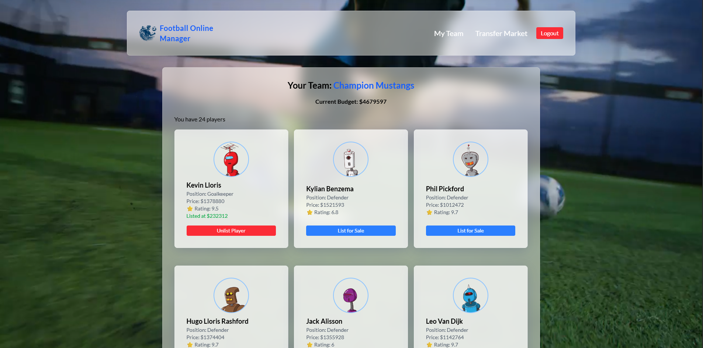
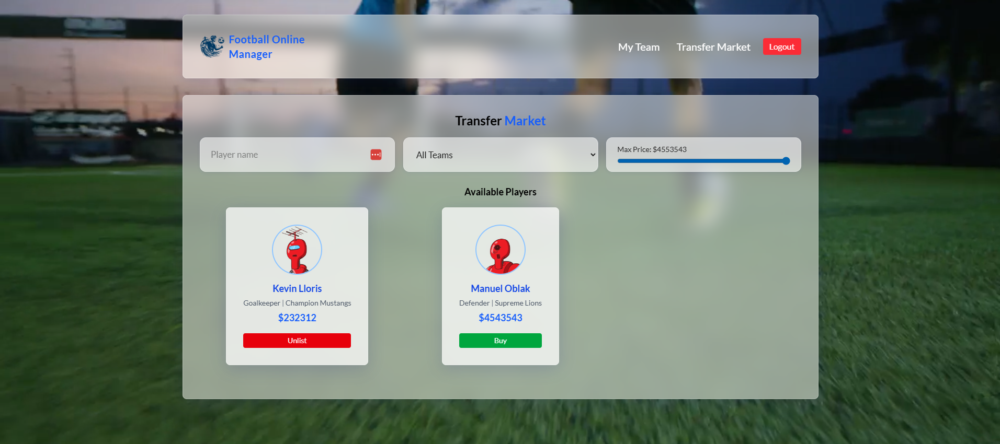

## Features

- User authentication (login/register)
- Manage your own football team
- Transfer market to buy and sell players
- Responsive design for desktop and mobile

## Project Structure

- `src/components/` — Reusable UI components (Navbar, PlayerCard, Modal, etc.)
- `src/pages/` — Main pages (Login/Register, MyTeam, TransferMarket, NotFound)
- `src/assets/` — Images and static assets
- `public/` — Public files (e.g., favicon, static images)

## Prerequisites

- Node.js (v16 or higher recommended)
- npm or yarn

## Getting Started

1. **Install dependencies:**

   ```bash
   npm install
   # or
   yarn install
   ```

2. **Start the development server:**

   ```bash
   npm run dev
   # or
   yarn dev
   ```

   The app will be available at `http://localhost:5173` by default.

3. **Build for production:**
   ```bash
   npm run build
   # or
   yarn build
   ```
   The production-ready files will be in the `dist/` folder.

## Backend API

This project expects a backend API running (e.g., at `http://localhost:5000`). Make sure to start the backend server before using the app. The frontend communicates with the backend for authentication, team management, and transfer market operations.

## Time Spent on Each Section

| Section                | Estimated Time Spent |
| ---------------------- | -------------------- |
| Project Setup          | 1 hour               |
| Authentication Pages   | 1.5 hours            |
| My Team Page           | 1 hour               |
| Transfer Market Page   | 2 hours              |
| Components (UI, Modal) | 1.5 hours            |
| Responsive Design      | 1 hour               |
| Testing & Debugging    | 1 hour               |
| README & Documentation | 0.5 hour             |


## Images

Below are some example screenshots of the application:

### Home / My Team Page



### Transfer Market Page



## Customization

- Update images in `src/assets/images/` as needed.
- Adjust styles in `src/App.css` and `src/index.css`.
